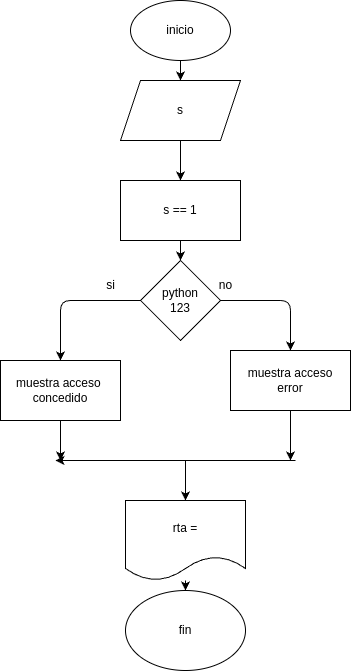

# El Validador de "Passwords"

## Analisis

### Variable de entrada
p = contraseña

### procedimiento
while True:
    p=input("error vuelve a ingresar tu contraseña: ")
    if p == "python123":
        print("contraseña correcta")
        break
print("-------------------")
print("fin del programa")
print("-------------------")

## Diseño

