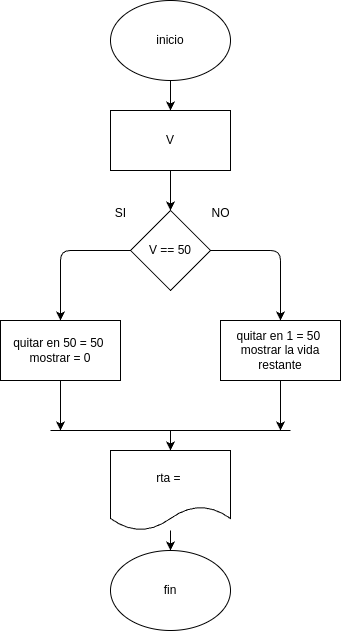

# Tu personaje tiene 50 puntos de vida (HP)

## Analisis

### Variable de entrada
V = Tu jefe tiene 50 puntos de vida (HP)

### procedimiento
hp = 50
while hp > 0:
    ataque = int(input("ingresa el daño del ataque: "))
    hp -= ataque
    print(f"tu jefe tiene {hp} HP")
print("-------------------")
print("tu jefe ha muerto")
print("-------------------")

## Diseño

