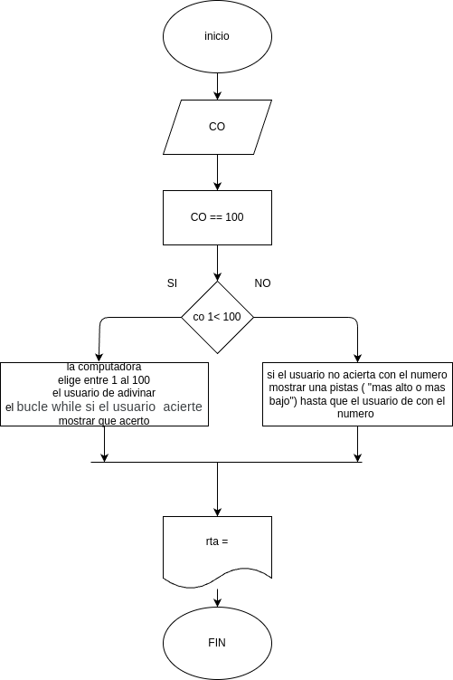

# Crea un juego donde la computadora elija un número del 1 al 100 

### Analisis

# Variables de entrada
co = numero

### procedimiento
numero_computadora = random.randint(1, 100)
intentos = 0
while True:
    intento_usuario = int(input("ingresa un número entre 1 y 100: "))
    intentos += 1
    if intento_usuario < numero_computadora:
        print("demasiado bajo, intenta de nuevo")
    elif intento_usuario > numero_computadora:
        print("demasiado alto, intenta de nuevo")
    else:
        print(f"¡felicidades! has adivinado el número en {intentos} intentos.")
        break

# Diseño 

