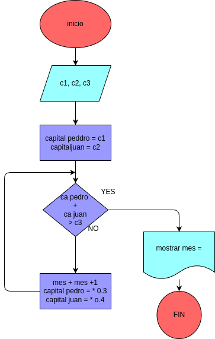

#  Pedro tiene un capital de c1 pesos, y Juan uno de c2 pesos

## Analisis

### variable de entrada 
c1 c2 c3

### procedimiento
n=0
while True:
    c1=c1+(c1*0.03)
    c2=c2+(c2*0.04)
    n=n+1
    if (c1+c2) >= 100000:
        break

## Diseño

